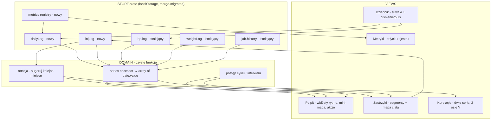

# feat: Rozszerzenie trackera — peptydy, TRT, objawy, mapa ciała, korelacje

## Summary

Rozbudowa `index.html` o: edytowalny rejestr metryk objawów, dzienny dziennik (suwaki + ciśnienie z pulsem), wspólny log zastrzyków dla Mounjaro / TRT / peptydów z wizualną mapą ciała (10 punktów podskórnych, rotacja), Pulpit jako ekran startowy z widżetami rytmu każdej substancji, oraz widok korelacji nakładający dowolne dwie serie czasowe. Wszystko w obecnej architekturze (jeden plik, vanilla JS, `localStorage`, inline-SVG, zero bibliotek, zgodność z CSP). Zero breaking changes: nowe pola dochodzą do `defaults()` i wchodzą przez istniejący `merge()`; istniejące `weightLog` i `jab.history` pozostają nietknięte.

## Problem Frame

Aplikacja śledzi dziś wagę i tygodniowe zastrzyki Mounjaro. Wchodzą równolegle trzy nowe zmienne: peptydy KLOW (codziennie), TRT (2-3x/tydzień, long-term) i tapering stymulantów. Bez jednego miejsca na objawy, vitale i zastrzyki nie da się wyciągnąć korelacji (dawka KLOW vs ból, tapering vs tętno/ciśnienie). Cel: ustawić baseline przed startem TRT/KLOW, przy wprowadzaniu < 30 s dziennie. Pełna analiza wymagań w origin: `docs/brainstorms/2026-06-28-health-tracking-expansion-requirements.md`.

---

## Key Technical Decisions

- **Migracja przez `merge()`, nigdy breaking.** Każda nowa struktura dochodzi jako nowy klucz w `STORE.defaults()` (index.html ~L826). `merge(defaults(), parsed)` (index.html ~L856) głęboko scala, więc stare backupy i `localStorage` doczytują się z domyślnymi wartościami nowych pól. Brak migracji istniejących `weightLog` / `jab.history`.
- **Wszystko jako seria czasowa.** Czysta funkcja w `DOMAIN` zwraca `[{date, value}]` dla danego źródła (metryka, dawka substancji z `injLog`, sys/dia/puls z `bp.log`, waga z `weightLog`, dawka Mounjaro). Korelacje i wykresy stoją na tym jednym kształcie.
- **Mounjaro: `jab.history` zostaje źródłem prawdy dla pierścienia.** Pierścień (`ringSVG`, index.html ~L1270) i `jab.history` nietknięte. Nowy uniwersalny `injLog` trzyma wszystkie zastrzyki (w tym Mounjaro) z miejscem wkłucia i dawką — do mapy ciała i korelacji. Logowanie Mounjaro w nowym UI zapisuje datę do `jab.history` (pierścień) i wpis do `injLog` (miejsce). Bezpieczne dla istniejących danych.
- **Definicje stref jako stała w kodzie, nie w stanie.** `INJ_SITES` (tablica 10 punktów z geometrią SVG) żyje w kodzie — dołożenie ramion później to dopisanie punktów bez migracji stanu. W `injLog` zapisywany jest tylko `siteId`.
- **Pulpit jest ekranem startowym i hubem.** Pasek dolny (realny baseline po dywergencji): Pulpit, Dziennik, Waga, Ciśnienie, Kalkulator, Ustawienia. Zastrzyki i Korelacje wchodzi się z kafelków Pulpitu (nie z paska) — decyzja użytkownika „Pulpit chowa rytmy". Mounjaro (dawna zakładka „Zastrzyk"/`#jab`) zostaje wchłonięte jako segment Zastrzyków; `#jab` przekierowuje na Pulpit. Ciśnienie i Kalkulator zostają osobnymi zakładkami (już istnieją).
- **Ciśnienie + puls już istnieją — nie duplikować.** Repo ma kompletną zakładkę „Ciśnienie" (`bp.log`, wpis `{id,ts,sys,dia,pulse,fasting,doseMg,note}`, wykres sys/dia/puls, backdating). Zostaje jak jest. `DOMAIN.seriesFor("vital:sys|dia|pulse")` czyta z `bp.log` (data = `ts.slice(0,10)`); Pulpit pokazuje ostatni odczyt. Wymaganie „puls nie obcięty" jest już spełnione.
- **BMI już istnieje — tylko wyeksponować.** Repo ma podgląd BMI w Ustawieniach i na Wadze. Pulpit pokazuje aktualne BMI z istniejącego `DOMAIN.bmi`; nie budujemy osobnego widoku.
- **Zakładka Koszt została usunięta w repo.** Z kalkulatorów został tylko „Kalkulator" (optimizer). Grupowanie „Narzędzia" jest więc zbędne.
- **Brak automatycznych testów (zgodnie z repo).** Weryfikacja jest manualna w przeglądarce (mobile + desktop, breakpoint 760px), jak w całym projekcie. „Test scenarios" poniżej to konkretne scenariusze weryfikacji manualnej.

---

## Requirements Traceability

Pełne R-ID w origin. Mapa na implementation units:

- Model danych i migracja (R1, R2, R3) → U1
- Rejestr metryk (R4-R7) → U5
- Dziennik dzienny + ciśnienie/puls (R8, R9, R10) → U6
- Zastrzyki / rytm (R11-R15) → U4
- Mapa ciała (R16-R20) → U3
- Dashboard (R21, R22) → U8
- Korelacje (R23, R24) → U7
- Wydanie / i18n (R25, R26) → U2 (i18n), U10 (cache bump)

---

## High-Level Technical Design

Przepływ danych — wszystko zbiega się w jednym stanie i jednym akcesorze serii:

---

## Implementation Units

### U1. Model danych + migracja + czyste helpery DOMAIN

- **Goal:** Dodać nowe struktury stanu i czyste funkcje, na których stoi reszta. Zero UI.
- **Requirements:** R1, R2, R3.
- **Dependencies:** brak.
- **Files:** `index.html` (`STORE.defaults()` ~L826; `DOMAIN` module ~L? — dopisać czyste funkcje obok istniejących).
- **Approach:** W `defaults()` dodać klucze: `metrics:[]`, `dailyLog:[]`, `injLog:[]`, oraz `inj:{ trt:{intervalDays:3, unit:"mg"}, peptide:{unit:"j", cycleDays:56, cycleStart:null}, mounjaro:{unit:"mg"} }`. (Ciśnienie/puls NIE dochodzą — istnieją w `bp.log`.) Wszystkie jako nowe klucze najwyższego poziomu, żeby `merge()` zadziałał jako migracja. W `DOMAIN` dopisać czyste funkcje: `seriesFor(state, sourceId)` → `[{date,value}]` (sourceId: `metric:<id>`, `inj:<substance>`, `vital:sys|dia|pulse` czyta z `bp.log`, `weight`, `mounjaroDose`); `suggestSite(injLog, sites)` → siteId najdawniej używany (licząc wszystkie substancje); `cycleProgress(cfg, today)` → `{dayN, total, frac}`; `intervalProgress(lastDate, intervalDays, today)` → `{remaining, frac}`. Reużyć `uid()`, `todayISO()`, `addDaysISO()`, `daysBetweenISO()`. **Status: zrobione i zmergowane (commit U1).**
- **Patterns to follow:** kształt wpisu `weightLog` `{id,date,...}` (index.html ~L1418); `merge()` jako mechanizm migracji (index.html ~L856); `DOMAIN` jest side-effect-free (CLAUDE.md).
- **Test scenarios (manual):**
  - Import backupu sprzed zmiany (JSON bez nowych kluczy) → aplikacja wstaje, `metrics/dailyLog/injLog` = `[]`, `inj` = domyślne, `weightLog`/`jab.history`/`bp.log` nietknięte.
  - `seriesFor` dla pustych logów → `[]`, dla logu z wpisami → posortowane rosnąco po dacie.
  - `suggestSite` przy pustym `injLog` → pierwszy punkt; przy zapełnionym → punkt o najstarszej ostatniej dacie użycia.
  - `cycleProgress` dla `cycleStart=null` → brak postępu (0/total); dla daty w środku cyklu → poprawny `dayN`.
- **Verification:** Stary backup importuje się bez błędu w konsoli; nowe pola obecne w `STORE.state`; czyste funkcje zwracają poprawne wartości wywołane z konsoli.

### U2. Klucze I18N (pl/en) dla całego nowego UI

- **Goal:** Komplet stringów obu języków dla nowych widoków.
- **Requirements:** R26.
- **Dependencies:** brak (równolegle z U1).
- **Files:** `index.html` (`I18N.dict` ~L230).
- **Approach:** Dodać klucze w konwencji `obszar.klucz` z `{pl,en}` dla: nawigacji (`tab.pulpit`, `tab.diary`, `tab.tools`), Pulpitu, Zastrzyków (segmenty, pola dawki/jednostki, cykl, interwał), mapy ciała (nazwy 10 stref), Dziennika, Metryk (typy, flaga „codzienna"), Korelacji (wybór serii). Każdy klucz w obu językach.
- **Patterns to follow:** istniejące wpisy `dict` (index.html ~L231-258); `applyStatic()` + `data-i` (index.html ~L2165).
- **Test scenarios (manual):** przełączenie języka pl/en w Ustawieniach nie zostawia surowych kluczy ani pustych etykiet w żadnym nowym widoku.
- **Verification:** brak widocznych `obszar.klucz` w UI po przełączeniu języka.

### U3. Wspólny komponent mapy ciała (inline-SVG)

- **Goal:** Sylwetka z 10 strefami: tap = wybór, kolory wg substancji, blaknięcie starszych, podświetlenie sugerowanego miejsca.
- **Requirements:** R16, R17, R18, R19, R20.
- **Dependencies:** U1.
- **Files:** `index.html` (nowy komponent w `UI`, np. `bodyMap(...)`; stała `INJ_SITES`; `SUBSTANCE_COLORS`).
- **Approach:** Stała `INJ_SITES` = 10 punktów `{id, label, x, y}`: brzuch 4 kwadranty, love handles 2L+2P, wewnętrzna strona uda L+P. Funkcja `bodyMapSVG(injLog, activeSubstance, onPick)` rysuje sylwetkę (proste kształty SVG) + kółka stref; ostatnie wkłucia każdej substancji kolorowane wg `SUBSTANCE_COLORS`, opacity maleje z wiekiem wpisu; sugerowane miejsce (`DOMAIN.suggestSite`) z obwódką. Klik strefy → `onPick(siteId)`. Wzorować rendering i interakcję na istniejącym SVG.
- **Patterns to follow:** inline-SVG bez bibliotek (`CHART.render` ~L1129, `ringSVG` ~L1270); klik-handlery jak w `bindChips` (~L1200).
- **Test scenarios (manual):**
  - Pusty `injLog` → wszystkie strefy puste, jedna podświetlona jako sugestia.
  - Po kilku wkłuciach różnych substancji → różne kolory, najstarsze bledsze, sugestia wskazuje wolną/najdawniejszą strefę.
  - Tap strefy wywołuje `onPick` z poprawnym `siteId`.
  - Render na wąskim ekranie nie przelewa się poziomo (mieści się w karcie).
- **Verification:** mapa renderuje się na mobile i desktop; kliknięcie zapisuje wybór; kolory rozróżniają substancje.

### U4. Silnik zastrzyków + widok Zastrzyki (segmenty Mounjaro / TRT / Peptydy)

- **Goal:** Jedna zakładka, przełącznik substancji, wspólny silnik logowania + mapa ciała, widżet rytmu per substancja.
- **Requirements:** R11, R12, R13, R14, R15.
- **Dependencies:** U1, U2, U3.
- **Files:** `index.html` (nowy `viewInject()` w `UI`; wpis w `routes`).
- **Approach:** Segmentowy przełącznik (wzór `chipRow`). Mounjaro: pierścień (`ringSVG` z `jab.history` + `calc.intervalDays`, jak obecny `viewJab`), log zapisuje datę do `jab.history` i wpis do `injLog` z `siteId`/dawką. TRT: pasek interwału (`DOMAIN.intervalProgress`, `inj.trt.intervalDays`), log do `injLog`. Peptydy: pasek cyklu (`DOMAIN.cycleProgress`, `inj.peptide.cycleDays/cycleStart`), pole jednostek, log do `injLog`. Każde logowanie otwiera `bodyMap` (U3) do wyboru miejsca, potem zapis + `STORE.save()` + re-render. Pola konfiguracyjne (interwał TRT, długość/start cyklu peptydów) edytowalne w segmencie.
- **Patterns to follow:** `viewJab` (~L1299) dla pierścienia i logowania; `STORE.save()` + re-render po zapisie.
- **Test scenarios (manual):**
  - Mounjaro: log dziś → pierścień resetuje, `jab.history` i `injLog` dostają wpis; istniejąca historia/pierścień działają jak dotąd.
  - TRT: ustaw interwał 3 dni, log → pasek startuje; po 3 dniach pokazuje „termin".
  - Peptydy: ustaw cykl 56 dni + start → pasek pokazuje „dzień X / 56"; log dzienny dopisuje do `injLog`.
  - Każdy log otwiera mapę ciała i zapisuje wybrane miejsce.
  - Edycja interwału/cyklu utrzymuje się po re-renderze i reloadzie.
- **Verification:** trzy segmenty logują do `injLog`, rytmy liczą się poprawnie, Mounjaro wstecznie kompatybilne.

### U5. Widok Metryki — edytowalny rejestr objawów

- **Goal:** Dodawanie/zmiana nazwy/archiwizacja metryk z UI, bez ruszania kodu.
- **Requirements:** R4, R5, R6, R7.
- **Dependencies:** U1, U2.
- **Files:** `index.html` (nowy `viewMetrics()` lub sekcja w Dzienniku; wejście z Dziennika/Pulpitu).
- **Approach:** Lista metryk z `state.metrics` (`{id, name, type, daily, archived}`; type ∈ `scale10|scale5|number|bool`). Formularz „dodaj": nazwa + typ + przełącznik „codzienna/doraźna". Edycja nazwy in-place; przycisk archiwizuj (ustawia `archived:true`, nie kasuje wpisów w `dailyLog`). Opcjonalny przycisk „dodaj zestaw startowy" seedujący metryki ze spec'a (ból łokcia, zapalenie oczu, rumień, mieszki, brain fog, przebodźcowanie, niepokój, napęd) — wszystkie edytowalne/usuwalne.
- **Patterns to follow:** formularze pól (`field`/`grid`), zapis + re-render jak w `viewWeight`.
- **Test scenarios (manual):**
  - Dodanie metryki typu scale10 z flagą „codzienna" → pojawia się w Dzienniku.
  - Zmiana nazwy → historyczne wartości w `dailyLog` zachowane, nowa nazwa w UI i w wyborze korelacji.
  - Archiwizacja → znika z dziennika, ale jej seria nadal dostępna w korelacjach.
  - „Zestaw startowy" dodaje metryki; ponowne kliknięcie nie duplikuje (idempotencja po nazwie/id).
- **Verification:** rejestr edytowalny; archiwizacja nie traci danych; metryki zasilają Dziennik i Korelacje.

### U6. Widok Dziennik — codzienne suwaki objawów

- **Goal:** Szybki dzienny wpis metryk „codziennych" jako suwaki, z edycją tego samego dnia.
- **Requirements:** R8, R9, R10.
- **Dependencies:** U1, U2, U5.
- **Files:** `index.html` (nowy `viewDiary()`; wpis w `routes`; pozycja w pasku nawigacji).
- **Approach:** Dla dzisiejszej daty render suwaków (`input type=range`) dla metryk `daily && !archived` z `state.metrics`; wartości czytane/zapisywane do wpisu `dailyLog` po dacie (`{id,date,values:{metricId:val},note}`). Ponowne wejście tego samego dnia pokazuje i pozwala poprawić dzisiejsze wartości (upsert po dacie). Ciśnienie/puls NIE są tu wpisywane — istnieje osobna zakładka „Ciśnienie" (`bp.log`); Dziennik daje tylko skrót/link do niej. Waga przez istniejący widok Waga, nie wymuszana.
- **Patterns to follow:** `viewWeight` dla formularza+zapisu; `input type=range` jako nowy element (dodać minimalny CSS klasy suwaka).
- **Test scenarios (manual):**
  - Brak metryk „codziennych" → pusty stan z linkiem do Metryk.
  - Ustawienie suwaków + zapis → `dailyLog` dostaje wpis dnia; ponowne wejście pokazuje te wartości i pozwala je zmienić (bez duplikatu daty).
  - Metryka doraźna (`daily:false`) nie pojawia się w codziennych suwakach.
  - Link „Ciśnienie" prowadzi do istniejącej zakładki BP (bez duplikatu formularza).
- **Verification:** dziennik zapisuje wartości per dzień z edycją; brak duplikatu funkcji ciśnienia.

### U7. Widok Korelacje — dwie serie, dwie osie Y

- **Goal:** Nałożyć dowolne dwie serie czasowe na wspólnej osi czasu.
- **Requirements:** R23, R24.
- **Dependencies:** U1, U2 (+ dane z U4/U6 do sensownego wykresu).
- **Files:** `index.html` (rozszerzenie `CHART` o `renderDual(...)` lub nowa funkcja; nowy `viewCorrelate()`; wejście z Pulpitu).
- **Approach:** Dwa selecty wyboru serii (źródła z `DOMAIN.seriesFor`: metryki nie-zarchiwizowane, dawki substancji, sys/dia/puls, waga, dawka Mounjaro). `CHART.renderDual(seriesA, seriesB)` — inline-SVG: wspólna oś X (czas), dwie niezależnie skalowane osie Y (lewa/prawa), dwie linie w różnych kolorach, legenda. Rozszerzyć istniejącą technikę z `CHART.render` (skalowanie X/Y, gridlines).
- **Patterns to follow:** `CHART.render` (~L1129) — skalery `X()`/`Y()`, gridlines, polyline.
- **Test scenarios (manual):**
  - Wybór serii A=dawka peptydu, B=metryka „ból łokcia" → dwie linie, każda we własnej skali, wspólna oś czasu.
  - Seria z jednym punktem / pusta → degraduje się czytelnie (brak wyjątku), komunikat o braku danych.
  - Daty rozjechane (różne dni dla A i B) → oś X obejmuje pełny zakres obu serii.
  - Render mieści się w karcie na mobile (scroll poziomy tylko wewnątrz kontenera, nie strony).
- **Verification:** dwie dowolne serie rysują się na dwóch osiach Y bez bibliotek; brak błędów przy skrajnych danych.

### U8. Pulpit (ekran startowy + hub)

- **Goal:** Rzut oka na rytm wszystkich substancji + status dnia + skróty.
- **Requirements:** R21, R22.
- **Dependencies:** U1, U3, U4, U6, U7.
- **Files:** `index.html` (nowy `viewDash()`; ustawiony jako domyślna trasa).
- **Approach:** Karty: (1) trzy widżety rytmu — Mounjaro (`ringSVG`/„następny za X dni"), TRT (pasek interwału), Peptydy (pasek cyklu „dzień X / total"); (2) status „Dziś" — czy zalogowano dziś objawy (`dailyLog` ma dzisiejszą datę) i peptyd (`injLog` peptide dziś); (3) mini-mapa ostatnich wkłuć (`bodyMap` w trybie podglądu); (4) ostatnie wartości — ciśnienie/puls (ostatni wpis z istniejącego `bp.log`), waga + Δ (z `weightLog`), aktualne **BMI** (reużyć istniejący `DOMAIN.bmi` z wzrostu z profilu i ostatniej wagi); (5) szybkie akcje — wejście w Zastrzyki, + objawy (Dziennik), Ciśnienie (istniejąca zakładka), + waga, Korelacje.
- **Patterns to follow:** `ringSVG`; istniejący `DOMAIN.bmi` i podgląd BMI w Ustawieniach; statystyki wagi z `viewWeight`; ostatni odczyt z `bp.log` jak w `viewBP`.
- **Test scenarios (manual):**
  - Świeży stan (brak danych) → widżety pokazują stany puste/„brak", bez wyjątków.
  - Po logach → rytmy liczą poprawnie, status „Dziś" zmienia ptaszki po zalogowaniu objawów/peptydu.
  - BMI liczone i pokazane gdy jest wzrost + waga; gdy brak wzrostu → łagodny placeholder z linkiem do Narzędzi.
  - Szybkie akcje nawigują do właściwych widoków.
- **Verification:** Pulpit jest domyślnym ekranem, agreguje rytmy, status, vitale, BMI i skróty bez błędów na pustym i wypełnionym stanie.

### U9. Restrukturyzacja routera i nawigacji

- **Goal:** Pasek: Pulpit, Dziennik, Waga, Ciśnienie, Kalkulator, Ustawienia; Zastrzyki/Korelacje z Pulpitu; `#jab` → Pulpit.
- **Requirements:** wspiera R21 (Pulpit jako start) i całość nawigacji.
- **Dependencies:** U4, U6, U7, U8 (trasy muszą istnieć).
- **Files:** `index.html` (`routes`; `currentTab()`; nav markup ~L215-220; default hash).
- **Approach:** Rozszerzyć `routes` o `pulpit`, `inject`, `diary`, `correlate` (zachować istniejące `weight`, `bp`, `optimizer`, `settings`; usunąć/aliasować `jab`). Przebudować `<nav class="tabs">`: zamienić pozycję „Zastrzyk"(`#jab`) na „Pulpit"(`#pulpit`) i dodać „Dziennik"(`#diary`) — pasek = Pulpit, Dziennik, Waga, Ciśnienie, Kalkulator, Ustawienia (ikony SVG w istniejącym stylu). `currentTab()` mapuje nieznane/`jab` → `pulpit`; domyślny hash `#pulpit`. `viewJab` przestaje być trasą paska — staje się segmentem w `viewInject` (U4). Zastrzyki(`#inject`) i Korelacje(`#correlate`) osiągalne z kafelków Pulpitu.
- **Patterns to follow:** `routes`/`render`/`currentTab`; nav `<a data-tab>` + `.on` toggle (~L216, ~L2161 sprzed dywergencji — zweryfikować aktualne numery).
- **Test scenarios (manual):**
  - Wejście bez hasha → ląduje na Pulpicie.
  - Stary `#jab` (zakładka/PWA shortcut) → przekierowuje na Pulpit bez błędu.
  - Pasek pokazuje 6 pozycji, aktywna podświetlona.
  - Zastrzyki i Korelacje osiągalne z Pulpitu; Ciśnienie i Kalkulator nadal w pasku.
  - Desktop (>760px) i mobile — pasek czytelny w obu (istniejący breakpoint).
- **Verification:** nawigacja spójna, brak martwych tras, Mounjaro w Zastrzyki, istniejące zakładki działają.

### U10. Bump cache i weryfikacja końcowa

- **Goal:** Wydanie — zainstalowane klienty pobierają nową wersję.
- **Requirements:** R25.
- **Dependencies:** U1-U9.
- **Files:** `sw.js` (`CACHE` ~L3).
- **Approach:** Podbić `CACHE` (z `mj-v32` na `mj-v33`). `ASSETS` bez zmian (brak nowych plików — wszystko w `index.html`).
- **Test scenarios (manual):** brak zmian funkcjonalnych; po deployu serwowanym po http(s) nowy SW przejmuje kontrolę i przeładowuje raz.
- **Verification:** `CACHE` podbity; pełny przepływ (log objawów, trzy typy zastrzyków z mapą, ciśnienie+puls, korelacja, Pulpit) działa serwowany przez `python3 -m http.server`.

---

## Scope Boundaries

Zgodnie z origin. W tym planie:
- **W zakresie:** rejestr metryk, dziennik + ciśnienie/puls, trzy substancje na wspólnym silniku, mapa 10 punktów, Pulpit, korelacje, restrukturyzacja nawigacji, zachowanie BMI.

### Deferred to Follow-Up Work
- Strefy ramion na mapie (model gotowy — dopisanie do `INJ_SITES`).
- Ponumerowane pod-punkty w strefie (precyzja co do punktu).
- Powiadomienia push o zastrzyku/cyklu.
- Tryb domięśniowy / osobna mapa dla iniekcji IM.

### Poza tożsamością aplikacji (z origin)
- Backend / konto / sync chmurowy poza istniejącym „linked file" i eksportem JSON.
- Wielu użytkowników.

---

## Risks & Mitigation

- **Ryzyko: regresja istniejących danych.** Mitigacja: nowe klucze tylko dodawane; `jab.history`/`weightLog` nietknięte; pierwszy scenariusz testowy U1 to import starego backupu. Dual-write Mounjaro (history + injLog) trzyma pierścień na starym źródle.
- **Ryzyko: rozdęcie jednego pliku i czytelność.** Mitigacja: trzymać granice modułów (DOMAIN czyste, UI render) zgodnie z CLAUDE.md; każdy unit = jeden commit z konta użytkownika (bez „Co-Authored-By").
- **Ryzyko: zatłoczona nawigacja na telefonie.** Mitigacja: 5 pozycji w pasku, reszta z Pulpitu i Narzędzi (decyzja użytkownika).
- **Ryzyko: złamanie CSP zewnętrznym zasobem.** Mitigacja: zero nowych network calls / bibliotek; cały rendering inline-SVG.

---

## Verification (end-to-end)

1. Serwuj: `python3 -m http.server` w katalogu repo, otwórz `http://localhost:8000`.
2. Import starego backupu JSON (sprzed zmian) → brak błędów, dane wagi/Mounjaro obecne.
3. Metryki: dodaj 2-3, jedną „codzienną" → pojawia się w Dzienniku.
4. Dziennik: ustaw suwaki + zapisz; wpisz ciśnienie 125/80 puls 64 → ponowne wejście pokazuje wartości; `vitalsLog` ma puls.
5. Zastrzyki: zaloguj Mounjaro (pierścień + mapa), TRT (pasek interwału + mapa), peptyd (pasek cyklu + mapa) → mapa pokazuje różne kolory i sugeruje kolejne miejsce.
6. Korelacje: wybierz dawka peptydu vs metryka bólu → dwie osie Y.
7. Pulpit: rytmy, status „Dziś", vitale, BMI, skróty działają.
8. Przełącz pl/en → brak surowych kluczy. Sprawdź mobile i desktop (760px).
9. Podbij `CACHE` w `sw.js`.
